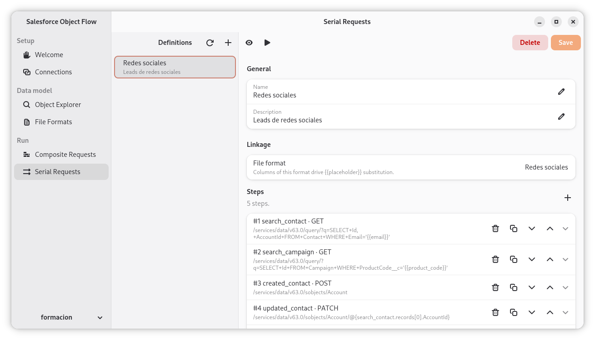

# Salesforce Object Flow

A native desktop GUI to import objects in Salesforce. Supports transactional imports via composite API requests and more complex behaviors by creating series of standard API requests that are triggered in series of steps that can be skipped depending on the results of the previous calls.

[](https://github.com/estudio-hawara/salesforce-object-flow/actions/workflows/ci.yml)
[](LICENSE)
[](https://www.python.org/downloads/)

## What it is

Salesforce Object Flow lets you assemble a single transactional Composite API call that creates objects across multiple related tables (Account + Contact + custom objects, etc.) in one round-trip — all-or-nothing, with per-field validation and clear error reporting on the rare partial-success edge case.

### Connections

Register one Salesforce org per environment (production, sandbox, scratch). Each connection points at your own External Client App so OAuth tokens stay scoped to credentials you control; the page hosts a step-by-step helper for that one-time Setup wiring. Test and Re-auth verify or refresh tokens without leaving the app, and the footer selector picks the active connection used by every other tab.


### Object Explorer

Browse the SObject catalogue of the active connection with type-ahead search across standard and custom objects. Selecting an object surfaces its CRUD capabilities and the full field list — API name, type, length, picklist size, and reference targets — so you can pick the right names while assembling a request.


### File Formats

Define how an input CSV (or other delimited file) is parsed: delimiter, quote character, header row, encoding, and a typed column schema with per-column nullability. Each saved format is a reusable template that drives `{{placeholder}}` substitution in Composite Requests.


### Composite Requests

Compose multi-step Composite API templates. A template binds to a File Format (its columns drive `{{placeholder}}` substitution from each input row), toggles `allOrNone` and same-method collation, and holds an ordered list of subrequests — HTTP method, REST path, and body — up to the Salesforce limit of 25 per call. The toolbar previews the resolved JSON and runs the request against the active connection.


### Serial Requests

When a flow can't fit into a single Composite payload — too many steps, branching that depends on a prior response, or steps that should be allowed to fail individually — assemble it as a Serial Request instead. A definition is an ordered list of independent REST calls; each step can carry a per-step condition (`exists`, `status_ok`, `records_count_gt`, `eq`, …) evaluated against earlier responses, references resolved client-side via `@{ref.path}`, and an `allowsFailure`-style `continue_on_failure` toggle. The executor runs the sequence once per CSV row and can export failed rows back to a CSV for cleanup and re-import.



## Status

`0.1.0a4` — fourth alpha. The five panes shown above are wired end-to-end: connections persist with secrets stored in the OS keyring, the Object Explorer reads the live SObject catalogue, and File Format, Composite Request and Serial Request definitions are saved locally and can be previewed and executed against the selected org. Expect rough edges around error reporting, partial-success handling on the Composite response, and template import/export — feedback and bug reports are very welcome.

## Languages

The UI ships translated to **English** (source) and **Spanish (`es`)**. The locale is picked up from your environment (`LANGUAGE`, `LC_ALL`, `LANG`); to force it for a single run:

```bash
LANGUAGE=es uv run salesforce-object-flow
```

Translations cover the whole UI plus service-layer error messages. Adding a new locale only requires translating `po/<lang>.po` — see the *Translations* section in [CONTRIBUTING.md](CONTRIBUTING.md) for the workflow.

## Install

The installation instructions for Linux, macOS and Windows are available at [INSTALL.md](INSTALL.md).

## Development

The full development workflow is described at [CONTRIBUTING.md](CONTRIBUTING.md).

## License

Salesforce Object Flow is licensed under an MIT license, available at [LICENSE](LICENSE).
