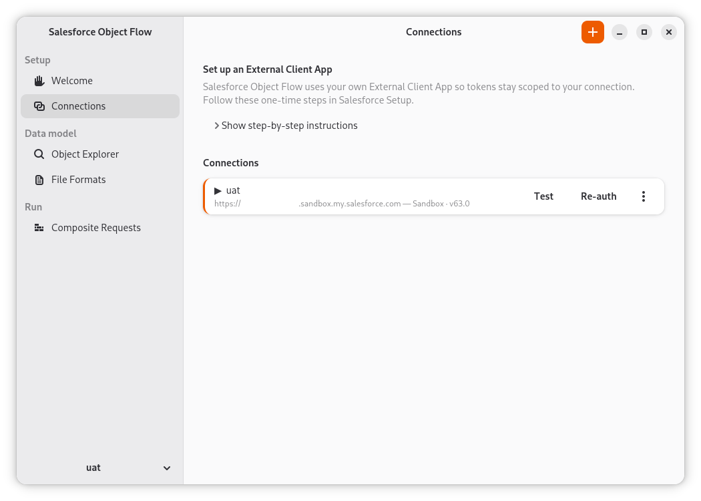
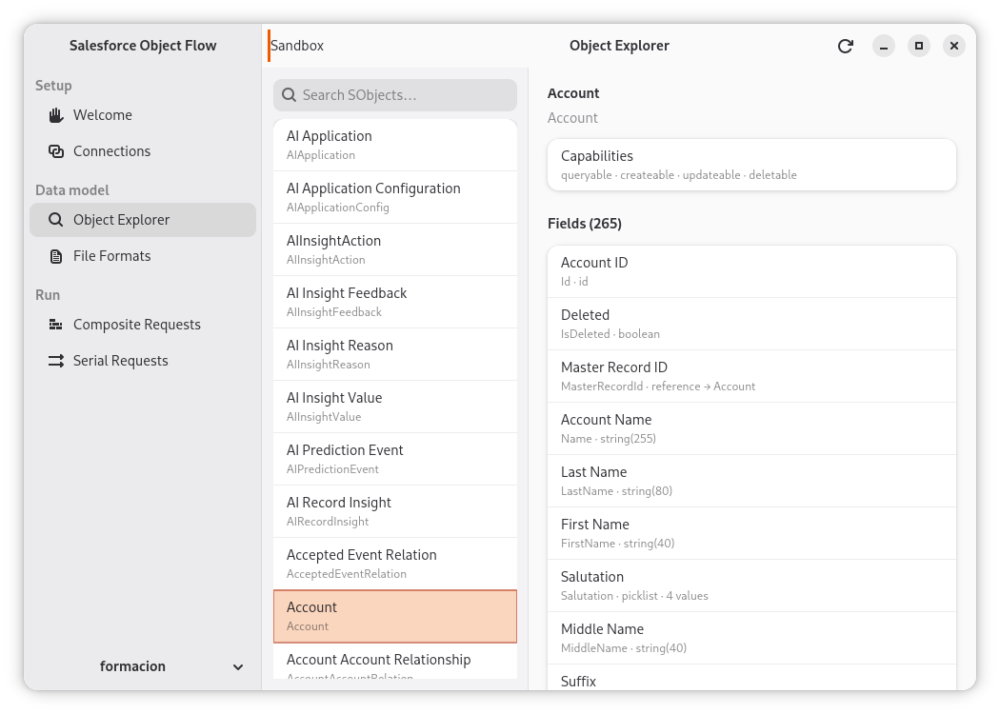
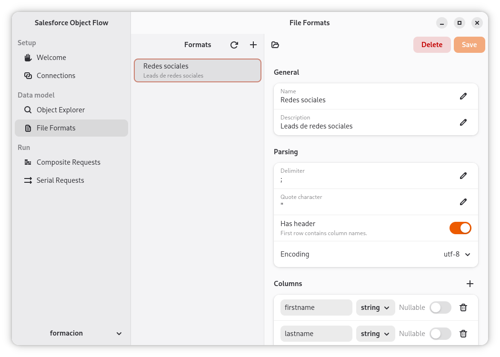
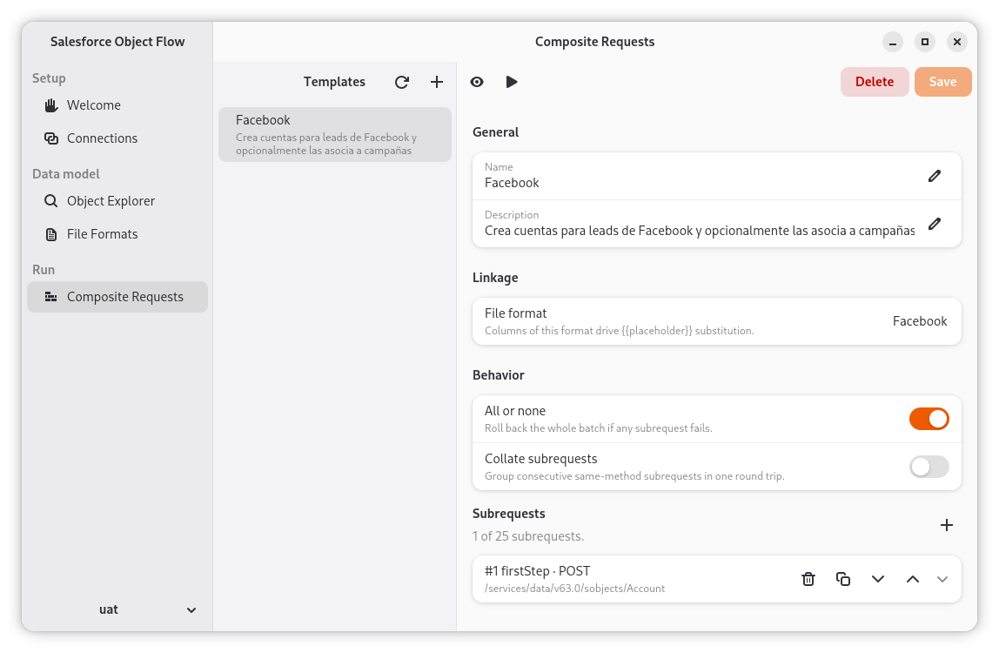

# Salesforce Object Flow

A native GTK4/libadwaita desktop GUI for Salesforce — compose multi-object, transactional creates against the Salesforce REST **Composite API** without leaving your desktop.

[](https://github.com/estudio-hawara/salesforce-object-flow/actions/workflows/ci.yml)
[](LICENSE)
[](https://www.python.org/downloads/)

## What it is

Salesforce Object Flow lets you assemble a single transactional Composite API call that creates objects across multiple related tables (Account + Contact + custom objects, etc.) in one round-trip — all-or-nothing, with per-field validation and clear error reporting on the rare partial-success edge case.

### Connections

Register one Salesforce org per environment (production, sandbox, scratch). Each connection points at your own External Client App so OAuth tokens stay scoped to credentials you control; the page hosts a step-by-step helper for that one-time Setup wiring. Test and Re-auth verify or refresh tokens without leaving the app, and the footer selector picks the active connection used by every other tab.



### Object Explorer

Browse the SObject catalogue of the active connection with type-ahead search across standard and custom objects. Selecting an object surfaces its CRUD capabilities and the full field list — API name, type, length, picklist size, and reference targets — so you can pick the right names while assembling a request.



### File Formats

Define how an input CSV (or other delimited file) is parsed: delimiter, quote character, header row, encoding, and a typed column schema with per-column nullability. Each saved format is a reusable template that drives `{{placeholder}}` substitution in Composite Requests.



### Composite Requests

Compose multi-step Composite API templates. A template binds to a File Format (its columns drive `{{placeholder}}` substitution from each input row), toggles `allOrNone` and same-method collation, and holds an ordered list of subrequests — HTTP method, REST path, and body — up to the Salesforce limit of 25 per call. The toolbar previews the resolved JSON and runs the request against the active connection.



## Status

`0.1.0a1` — first alpha. The four panes shown above are wired end-to-end: connections persist with secrets stored in the OS keyring, the Object Explorer reads the live SObject catalogue, and File Format and Composite Request templates are saved locally and can be previewed and executed against the selected org. Expect rough edges around error reporting, partial-success handling on the Composite response, and template import/export — feedback and bug reports are very welcome.

## Install

Salesforce Object Flow is cross-platform. The polished daily-driver target is **Linux**; macOS and Windows are supported via Homebrew and MSYS2 respectively and may exhibit minor libadwaita theming quirks.

### Linux (Debian / Ubuntu names)

```bash
sudo apt install libcairo2-dev libgirepository-2.0-dev libgtk-4-dev libadwaita-1-dev
git clone https://github.com/estudio-hawara/salesforce-object-flow.git
cd salesforce-object-flow
uv sync
uv run salesforce-object-flow
```

On Fedora / Arch / openSUSE, install the equivalent `gtk4`, `libadwaita`,
`gobject-introspection`, and `cairo` development packages.

### macOS

```bash
brew install gtk4 libadwaita gobject-introspection pygobject3
git clone https://github.com/estudio-hawara/salesforce-object-flow.git
cd salesforce-object-flow
uv sync
uv run salesforce-object-flow
```

### Windows

Install [MSYS2](https://www.msys2.org/) and open the **UCRT64** shell:

```bash
pacman -S mingw-w64-ucrt-x86_64-gtk4 \
          mingw-w64-ucrt-x86_64-libadwaita \
          mingw-w64-ucrt-x86_64-python \
          mingw-w64-ucrt-x86_64-python-gobject \
          mingw-w64-ucrt-x86_64-python-pip \
          git
git clone https://github.com/estudio-hawara/salesforce-object-flow.git
cd salesforce-object-flow
python -m venv --system-site-packages .venv
source .venv/bin/activate
pip install httpx keyring platformdirs pygobject-stubs
pip install --no-deps -e .
salesforce-object-flow
```

uv is not used on Windows: the MSYS2 Python reports its platform as `mingw_x86_64_ucrt_gnu`, which uv does not recognize. The pure-Python deps are installed explicitly and the project itself is installed with `--no-deps` so pip does not try to rebuild PyGObject (and its pycairo / gobject-introspection build chain) from PyPI — the venv reuses the PyGObject that `pacman` already installed, linked against the MSYS2-shipped GTK4 DLLs.

The app must be launched from the UCRT64 shell so that GTK4 typelibs and libadwaita are visible to PyGObject.

## Development

```bash
uv sync
uv run salesforce-object-flow

uv run pytest tests/ -v
uv run ruff check salesforce_object_flow/ tests/
uv run ruff format --check salesforce_object_flow/ tests/
uv run pyright salesforce_object_flow/ tests/
```

See [CONTRIBUTING.md](CONTRIBUTING.md) for the full development workflow.

## License

MIT — see [LICENSE](LICENSE).
